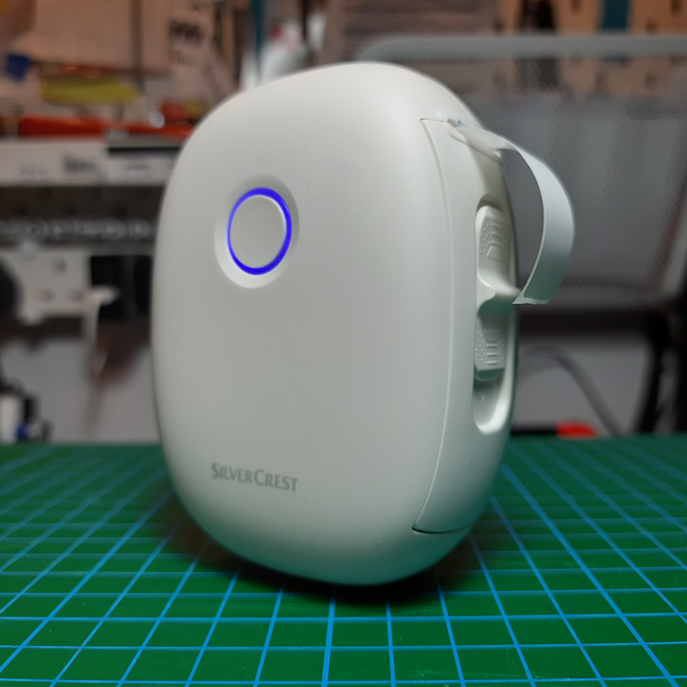

# L13 Thermal Printer Reverse Engineering Notes
These notes describe what I've learned about how the L13 Thermal Label Printer works.  These notes are presented in a very objective way, but I made a [writeup](https://atctwo.net/posts/2024/07/09/thermal-printer.html) about the reverse engineering process if that sounds fun to read.

# Device Information
- Original product name is **L13**
- Original manufacturer is **Xiamen Print Future Technology Co.,Ltd.**
- I bought my printer from a **Lidl** in Northern Ireland, sold under the **Silvercrest** brand
    - distrubuted to Lidl by **Karsten International**
- FCC ID: 2A6FW-L13

## Hardware
- has a USB-C port for charging (and communication, although this appears to be undocumented)
- support for Bluetooth and BLE
- has a big button on the front for turning on / off the device
- the button has an LED-lit ring around it to show status

| LED Colour | Meaning                                                                                             |
|------------|-----------------------------------------------------------------------------------------------------|
| Off        | Powered off                                                                                         |
| Red        | When powered off, indicates the battery is charging When powered on, indicates there is no paper |
| Blue       | Powered on and connected via SPP                                                                    |
| Green      | Powered on but in none of the above states                                                          |

## Paper Specifications
- designed for 14mm wide tape
- expected to be used with 14x30mm labels on a tape, although other lengths should work
- 203 dpi

## Device IDs
- USB
  - vid=`0x09c7` ("Printer"), pid=`0x0011` ("Printer")
- Bluetooth
  - MAC addresses for my specific printer
    - BD/EDR: `55:55:09:06:9D:0B`
    - BLE: `5E:55:09:06:9D:0B`
- firmware info (provided by my printer)
  - model number: `DP-L13`
  - firmware version: `V3.05`
  - serial number: `L1324144345`

## Official Software
- the box for my printer has a QR code pointing to the offical app called **Pocket Printer** (`com.printer.lidloffice`)
  - [App Store](https://apps.apple.com/us/app/pocket-printer/id6444190726?mt=8), [Google Play Store](https://play.google.com/store/apps/details?id=com.printer.lidloffice)
  - published by Karsten
  - version 1.2.8
- Karsten also publish a similar app called **Fichero Printer** for use with the same model, sold under a different brand
  - [App Store](https://apps.apple.com/us/app/fichero-printer/id6503137258), [Google Play Store](https://play.google.com/store/apps/details?id=com.lj.fichero)
  - version 1.0.3

## Miscellaneous
- it has an IR sensor to detect whether there's paper
- if you double click the big button on the front it prints a debug label
  - it has a QR code which encodes the following text: `<model_number>?<mac_address>`
  - it also prints the model number and firmware version number
- uses a YiChip YC3121-D MCU

# Command Interfaces
- uses a mostly non-standard communication command set (described in next section)
- supports commands over the following interfaces: USB, Bluetooth Serial Port Profile, four BLE services

## USB

Output of <code>lsusb -v -d 0x09c7:0x0011</code>

<pre>
Bus 001 Device 014: ID 09c7:0011 Printer Printer
Device Descriptor:
  bLength                18
  bDescriptorType         1
  bcdUSB               2.00
  bDeviceClass            0 [unknown]
  bDeviceSubClass         0 [unknown]
  bDeviceProtocol         0 
  bMaxPacketSize0        64
  idVendor           0x09c7 Printer
  idProduct          0x0011 Printer
  bcdDevice            2.00
  iManufacturer           1 Printer
  iProduct                2 Printer
  iSerial                 3 0B9D02CF0601
  bNumConfigurations      1
  Configuration Descriptor:
    bLength                 9
    bDescriptorType         2
    wTotalLength       0x0020
    bNumInterfaces          1
    bConfigurationValue     1
    iConfiguration          0 
    bmAttributes         0xc0
      Self Powered
    MaxPower              100mA
    Interface Descriptor:
      bLength                 9
      bDescriptorType         4
      bInterfaceNumber        0
      bAlternateSetting       0
      bNumEndpoints           2
      bInterfaceClass         7 Printer
      bInterfaceSubClass      1 Printer
      bInterfaceProtocol      2 Bidirectional
      iInterface              0 
      Endpoint Descriptor:
        bLength                 7
        bDescriptorType         5
        bEndpointAddress     0x01  EP 1 OUT
        bmAttributes            2
          Transfer Type            Bulk
          Synch Type               None
          Usage Type               Data
        wMaxPacketSize     0x0040  1x 64 bytes
        bInterval               0
      Endpoint Descriptor:
        bLength                 7
        bDescriptorType         5
        bEndpointAddress     0x81  EP 1 IN
        bmAttributes            2
          Transfer Type            Bulk
          Synch Type               None
          Usage Type               Data
        wMaxPacketSize     0x0040  1x 64 bytes
        bInterval               0
cannot read device status, Resource temporarily unavailable (11)
</pre>

<code>dmesg</code> output when attaching the printer to my computer

<pre>
[15302.412382] usb 1-4: new full-speed USB device number 14 using xhci_hcd
[15302.556885] usb 1-4: New USB device found, idVendor=09c7, idProduct=0011, bcdDevice= 2.00
[15302.556896] usb 1-4: New USB device strings: Mfr=1, Product=2, SerialNumber=3
[15302.556900] usb 1-4: Product: Printer
[15302.556903] usb 1-4: Manufacturer: Printer
[15302.556905] usb 1-4: SerialNumber: 0B9D02CF0601
</pre>

## Serial Port Profile
Command data can be sent to / received from the printer as regular serial data.

## Bluetooth Low Energy
Each of the implemented BLE services implement a basic serial interface.  Command data can be sent to any *RX* characteristic and responses can be read from any *TX* characteristic.

### BLE Services
#### Service `0x18f0`
- `0x2af0` NOTIFY, 0x2902, *TX*
- `0x2af1` WRITE + NO RESPONSE, *RX*

#### Service `0xff00`
- `0xff01` NOTIFY, 0x2902, *TX*
- `0xff02` WRITE + NO RESPONSE, *RX*
- `0xff03` NOTIFY, 0x2902, *???*

#### Service `e7810a71-73ae-499d-8c15-faa9aef0c3f2`
- `bef8d6c9-9c21-4c9e-b632-bd58c1009f9f` NOTIFY, WRITE + NO RESPONSE, 0x2902, *TX and RX*

#### Service `49535343-fe7d-4ae5-8fa9-9fafd205e455`, *Transparent UART*
- `49535343-1e4d-4bd9-ba61-23c647249616` NOTIFY, 0x2902, *UART TX*
- `49535343-8841-43f4-a8d4-ecbe34729bb3` WRITE + NO RESPONSE, *UART RX*
- `49535343-aca3-481c-91ec-d85e28a60318` NOTIFY, WRITE, 0x2902, *???*
- This appears to be the transparent UART characteristic (eg: used in [Microchip's BM70 BLE module](https://developerhelp.microchip.com/xwiki/bin/view/applications/ble/android-development-for-bm70rn4870/transparent-uart-service-for-bm70rn4870/))

# Command Set
This section describes the commands that the printer understands.  Much of this info was extracted from Bluetooth HCI logs created while using Pocket Printer on an Android device.

## Raster Images
The only way I've been able to get the printer to print anything is in the form of the [ESC/POS Raster Image](https://download4.epson.biz/sec_pubs/pos/reference_en/escpos/gs_lv_0.html) command.  Note that the printer doesn't seem to support ESC/POS, only this command and a few others.

The parameters for the width of the image (`xL` and `xH`) correspond fo the width of the label.  The labels provided with the printer are 14mm wide.  The commands sent by Pocket Printer set `xL xH` to `0C 00`, which corresponds to the width of the image being 96 pixels (12 bytes per horizontal row, at 8 x 1-bit pixels per byte).

The parameters for the height of the image (`yL` and `yH`) correspond to the length of the label.  Pocket Printer assumes that the labels are 30mm long, and at 203 dpi that works out at 240 pixels, so `yL yH` will be `F0 00`.  For 40mm labels, that works out at 320 pixels, so `yL yH` will be `40 01`.

## Feeding Paper
To feed the roll to align the next label for printing, Pocket Printer issues the following command sequence:
1. `10 0C` (form feed)
2. `1B 4A 28` (print and feed paper)

## Other Supported Commands
Note: this list is possibly non-exhausive.  These are all the commands I was able to find being issued by Pocket Printer, but it is possible that other commands are implemented.

| Command Bytes       | Function                              | Notes                                                                               |
|---------------------|---------------------------------------|-------------------------------------------------------------------------------------|
| `10 FF 20 F0`       | returns model number                  | my printer returns `DP-L13`                                                         |
| `10 FF 20 F1`       | returns firmware version              | my printer returns `V3.05`                                                          |
| `10 FF 20 F2`       | returns serial number                 | my printer returns `L1324144345`                                                    |
| `10 FF 50 F1`       | returns battery level                 | the least significant byte is the charge level in percent (eg: `00 5C` means 92%)   |
| `10 FF 40`          | returns paper status                  | returns `0x00` if there is paper and `0x04` if there is no paper                    |
| `10 FF 10 00 n`     | set print density                     | where n = `0x00` for light, `0x01` for medium, `0x02` for thick                     |
| `10 FF 12 00 n`     | set auto-shutdown timeout             | where n is the timeout in minutes the official app supports 5, 10, 20, 30, 60    |
| `10 FF F1 30` and 12x`00`s | ???                            | sent before sending image command                                                   |
| `10 FF F1 45`       | ???                                   | sent after sending image command                                                    |
| `10 FF 13`          | ???                                   | responded `0x14` in my testing                                                      |
| `10 FF 11`          | ???                                   | responded `0x01 0x0a 0x01` in my testing                                            |

## Print Sequence
This is the sequence of commands used by Pocket Printer when printing a label.

1. Check if there's paper - `10 FF 40`
2. If there is paper, send ??? - `10 FF F1 03` followed by 12 `00`s
3. Print Raster Image - `1D 76 30 00 0C 00 F0 00` followed by image data
4. Form Feed - `10 0C`
5. Print and Feed - `1B 4A 28`
6. Send ??? - `10 FF F1 45`

Note that this sequence seems to work with no issues if the two ??? commands are omitted.

# Research Sources
## ESC/POS
- [ESC/POS introduction](https://mike42.me/blog/what-is-escpos-and-how-do-i-use-it) by mike42 
- [tutorial on getting USB thermal printers working under usblp](https://mike42.me/blog/2015-03-getting-a-usb-receipt-printer-working-on-linux) by mike42
- [python-escpos](https://python-escpos.readthedocs.io/en/latest/index.html) library for sending esc/pos commands
- [Command Table for Pyramid printers](https://escpos.readthedocs.io/en/latest/commands.html)
- [Epson ESC/POS command reference](https://download4.epson.biz/sec_pubs/pos/reference_en/escpos/commands.html)
- [Flutter library for creating raster image commands from text, for Phomemo printers](https://github.com/Knightro63/phomemo)

## BLE
- [this blog post](https://www.b4x.com/android/forum/threads/ble-mini-printer.79747/) seems to be talking about a printer with the same protocol (based on the BLE service UUIDs)
- [github issue about a printer with the UART characteristic](https://github.com/bitbank2/Thermal_Printer/issues/37)
- [bitbank2's Thermal_Printer arduino library](https://github.com/bitbank2/Thermal_Printer/blob/master/src/Thermal_Printer.cpp), which accounts for multiple possible BLE service UUIDs a printer could be using for ESC/POS
- [article on the BLE characteristics of another printer (PT-210)](https://citrusdev.com.ua/portable-bluetooth-thermal-printer-goojprt-pt-210/)
- [Cat-Printer](https://github.com/NaitLee/Cat-Printer), a web app for using cat printers (which generally use the same UART characteristic)
- [Phomemo M02S library](https://github.com/theacodes/phomemo_m02s) by theacodes
- [Phomemo D30 library](https://github.com/crabdancing/phomemo-d30) by crabdancing
- [Phomemo D30 library](https://github.com/polskafan/phomemo_d30) by polskafan